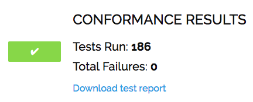

# Miscellaneous

## Troubleshooting

* [Reading the system log](https://coreos.com/os/docs/latest/reading-the-system-log.html)

## Smoke Test

* [Kubernetes the Hard Way Smoke Test](https://github.com/kelseyhightower/kubernetes-the-hard-way/blob/master/docs/13-smoke-test.md)

* [Deploy Guest Book Application](https://github.com/kubernetes/examples/tree/master/guestbook-go)

## Configuring kubectl for Remote Access

```
KUBERNETES_PUBLIC_ADDRESS=172.18.30.20

kubectl config set-cluster the-hard-way-metal \
  --certificate-authority=ca.pem \
  --embed-certs=true \
  --server=https://${KUBERNETES_PUBLIC_ADDRESS}:6443

kubectl config set-credentials admin \
  --client-certificate=admin.pem \
  --client-key=admin-key.pem

kubectl config set-context the-hard-way-metal \
  --cluster=the-hard-way-metal \
  --user=admin

kubectl config use-context the-hard-way-metal
```

## Limitation

* [Metrics Server](https://github.com/kubernetes-incubator/metrics-server) won't Work

  > [GitHub Issue](https://github.com/kubernetes-incubator/metrics-server/issues/22)

  > 1. The [Aggregation Layer](https://kubernetes.io/docs/tasks/access-kubernetes-api/configure-aggregation-layer/) is required

  > 2. The connectivities to Pod and Service network is required by API Server, while it won't be possible without additional routing changes at API Server instances. The solution is to add master instances to cluster nodes that allow containers running on master where CNI network setup for API servers to talk to Pod/Service networks.

## Appendix

### A. Add Master to Nodes Cluster

* Generate `kubelet` client certificates for master instances. Distribute appropriate files to the instance.
* Follow the [Bootstrapping the Worker Nodes](05-bootstrapping-kubernetes-workers.md) to complete the steps on Master instances.
* Label the master with `node-role.kubernetes.io/master=""``
* Taints the masters with `node-role.kubernetes.io/master:NoSchedule`

```
kubectl label node k8s-master-1 node-role.kubernetes.io/master=""

kubectl taint nodes k8s-master-1 node-role.kubernetes.io/master="":NoSchedule

kubectl get nodes

NAME           STATUS   ROLES    AGE   VERSION
k8s-master-1   Ready    master   1d    v1.11.4
k8s-master-2   Ready    master   23h   v1.11.4
k8s-master-3   Ready    master   23h   v1.11.4
k8s-worker-1   Ready    <none>   2d    v1.11.4
k8s-worker-2   Ready    <none>   2d    v1.11.4
k8s-worker-3   Ready    <none>   2d    v1.11.4
```

### B. Kubernetes Conformance Testing

Use [Heptio Sonobuoy](https://github.com/heptio/sonobuoy) to validate the Kubernetes cluster. The quickest way to get started is to use its browser-based [Sonobuoy Scanner tool](https://scanner.heptio.com/). The scan results is very comprehensive to list all the test cases performed and detailed trace for failed cases.

With Appendix A enabled, the scan results all passed.




### C. Install Metrics Server

[metrics-server](https://github.com/kubernetes-incubator/metrics-server) is the popular one to replace deprecated [Heapster](https://github.com/kubernetes/heapster) to gather Prometheus-format metrics.

Go to [the link](appendix-enabling-metrics-server.md) for details.


Prev: [Deploying the MetalLB](08-deploying-the-metallb.md)
